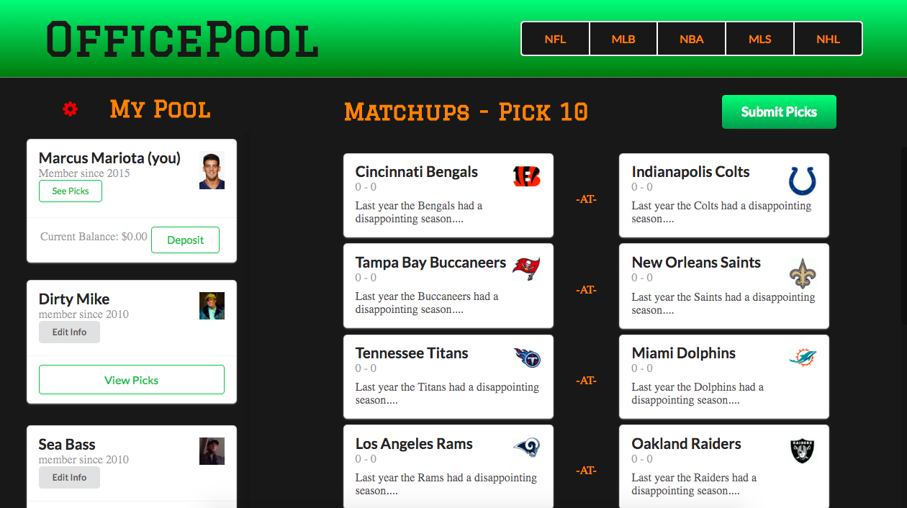

# **OfficePool**

OfficePool allows users to create 'pools' with friends and coworkers to see who
is the best at guessing outcomes of sports matches.
[Here](https://office-pool-tower.firebaseapp.com/) is a link to the site!
To contribute, fork and clone this repo to your local machine and run ```npm install```
to install dependencies. 

### **Backend repo**

https://github.com/mhyrka/gearup-back

### **Built With**

React.js
Express.js
Knex
Postgresql
Semantic UI - react
Cypress
Node.js

### **Author**

Matthew Hyrka

### **License**

This project is licensed under the MIT License - see the LICENSE.md file for details


